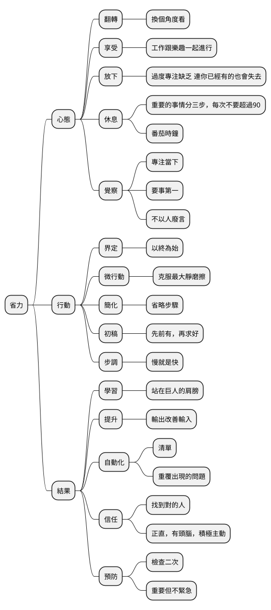

# 努力，但不費力

# mind map

```plantuml
@startmindmap
+ 省力
++ 心態
+++ 翻轉
++++ 換個角度看
+++ 享受
++++ 工作跟樂趣一起進行
+++ 放下
++++ 過度專注缺乏 連你已經有的也會失去
+++ 休息
++++ 重要的事情分三步，每次不要超過90
++++ 番茄時鐘
+++ 覺察
++++ 專注當下
++++ 要事第一
++++ 不以人廢言
++ 行動
+++ 界定
++++ 以終為始
+++ 微行動
++++ 克服最大靜磨擦
+++ 簡化
++++ 省略步驟
+++ 初稿
++++ 先前有，再求好
+++ 步調
++++ 慢就是快
++ 結果
+++ 學習
++++ 站在巨人的肩膀
+++ 提升
++++ 輸出改善輸入
+++ 自動化
++++ 清單
++++ 重覆出現的問題
+++ 信任
++++ 找到對的人
++++ 正直，有頭腦，積極主動
+++ 預防
++++ 檢查二次
++++ 重要但不緊急
@endmindmap

```